Я створю декілька варіантів графічної візуалізації цієї архітектури для вас.

## 🎨 Графічна Візуалізація Архітектури

### **Варіант 1: Mermaid - Вертикальна Архітектура**

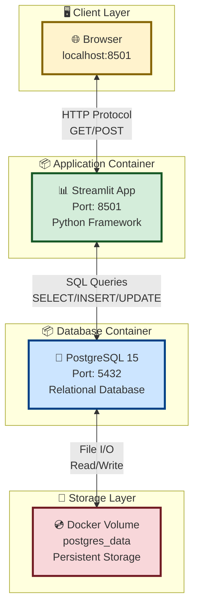

---

### **Варіант 2: Mermaid - Горизонтальний Flow**

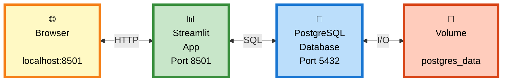

---

### **Варіант 3: Детальна Архітектура з Docker**

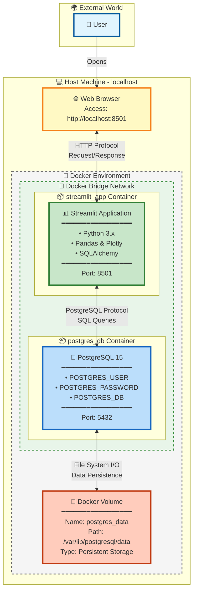

---

### **Варіант 4: Sequence Diagram (Послідовність Взаємодії)**

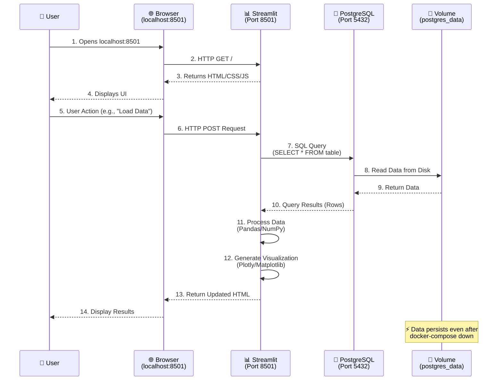

---

### **Варіант 5: Компонентна Діаграма з Layers**

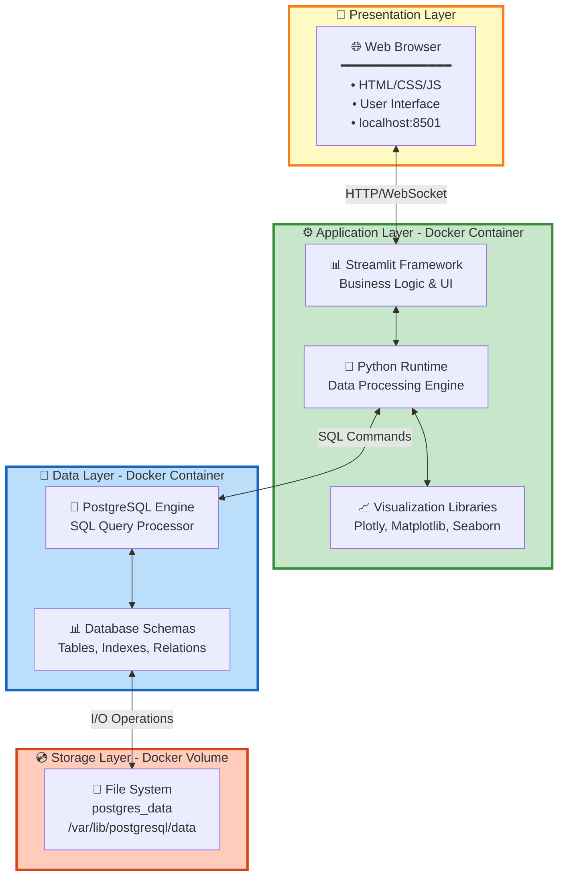

---

### **Варіант 6: Network Topology**

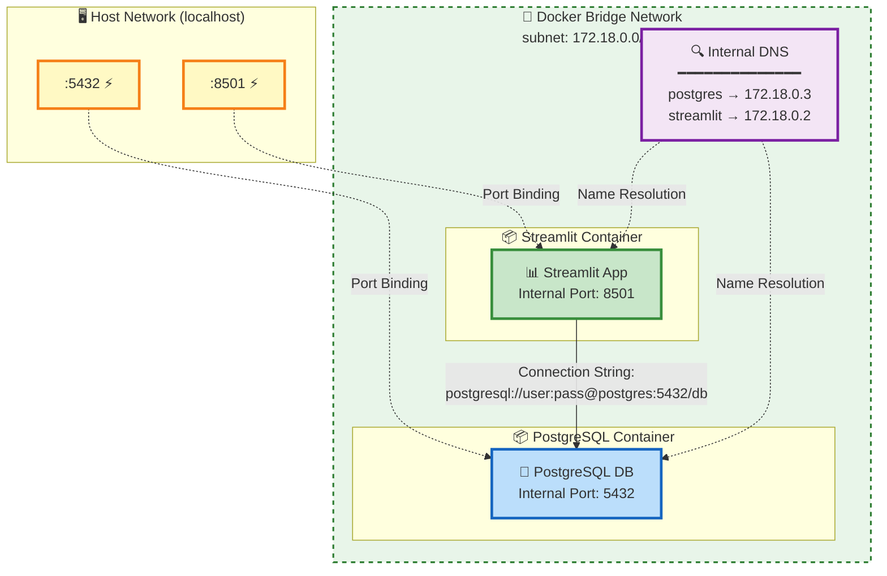

---

### **Варіант 7: Data Flow Diagram**

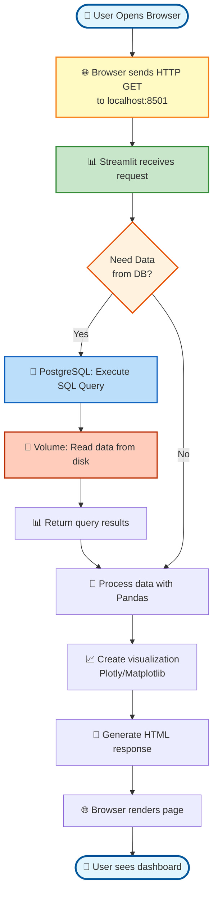

---

### **Варіант 8: Deployment View**

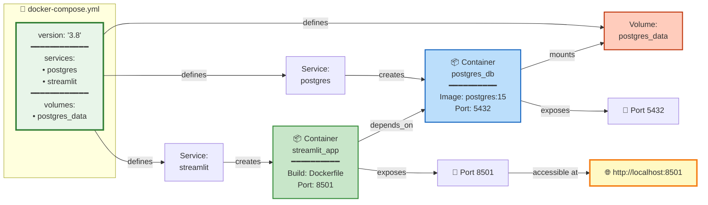

---

### **Варіант 9: Technology Stack**

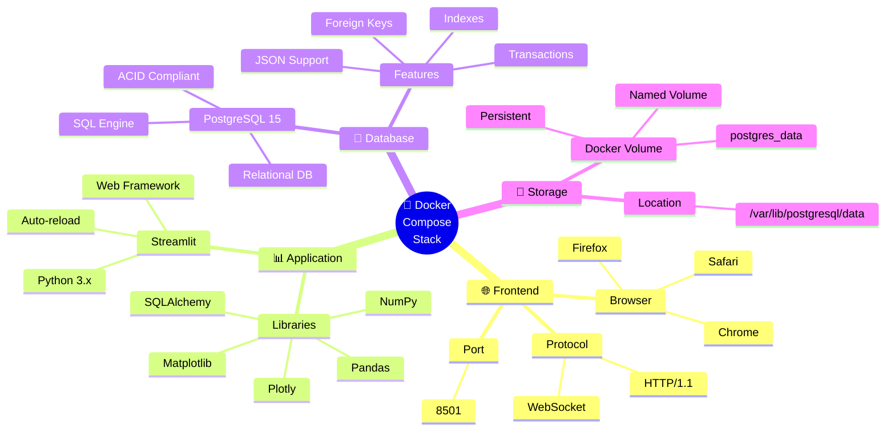

---

### **Варіант 10: Простий Icon Flow**

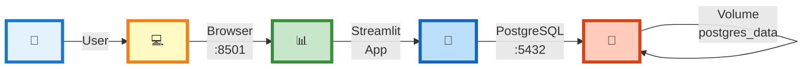

---

### **Варіант 11: ASCII Art (для документації)**

```
                    ╔══════════════════════════════════════════╗
                    ║     🐳 Docker Compose Architecture       ║
                    ╚══════════════════════════════════════════╝

                              👤 User
                               │
                               │ Opens browser
                               ▼
                    ┌─────────────────────────┐
                    │   🌐 Web Browser         │
                    │   localhost:8501         │
                    └────────────┬─────────────┘
                                 │
                                 │ HTTP GET/POST
                                 ▼
        ╔═══════════════════════════════════════════════════════════╗
        ║              🐳 DOCKER ENVIRONMENT                         ║
        ║                                                            ║
        ║   ┌─────────────────────────────────────────────────┐    ║
        ║   │  📦 Streamlit Container (streamlit_app)          │    ║
        ║   │  ┌────────────────────────────────────────────┐ │    ║
        ║   │  │  📊 Streamlit Application                   │ │    ║
        ║   │  │  ━━━━━━━━━━━━━━━━━━━━━━━━━━━━━━━━━━━━━━━ │ │    ║
        ║   │  │  • Framework: Streamlit                    │ │    ║
        ║   │  │  • Language: Python 3.x                    │ │    ║
        ║   │  │  • Libraries: Pandas, Plotly               │ │    ║
        ║   │  │  • Port: 8501                              │ │    ║
        ║   │  └────────────────┬───────────────────────────┘ │    ║
        ║   └───────────────────┼───────────────────────────────┘    ║
        ║                       │                                     ║
        ║                       │ SQL Queries                         ║
        ║                       │ (SELECT, INSERT, UPDATE, DELETE)    ║
        ║                       ▼                                     ║
        ║   ┌─────────────────────────────────────────────────┐    ║
        ║   │  📦 PostgreSQL Container (postgres_db)           │    ║
        ║   │  ┌────────────────────────────────────────────┐ │    ║
        ║   │  │  🐘 PostgreSQL 15 Database                  │ │    ║
        ║   │  │  ━━━━━━━━━━━━━━━━━━━━━━━━━━━━━━━━━━━━━━━ │ │    ║
        ║   │  │  • POSTGRES_USER: your_user                │ │    ║
        ║   │  │  • POSTGRES_DB: your_database              │ │    ║
        ║   │  │  • Port: 5432                              │ │    ║
        ║   │  └────────────────┬───────────────────────────┘ │    ║
        ║   └───────────────────┼───────────────────────────────┘    ║
        ║                       │                                     ║
        ║                       │ File I/O (Read/Write)              ║
        ║                       ▼                                     ║
        ║   ┌─────────────────────────────────────────────────┐    ║
        ║   │  💾 Docker Named Volume                          │    ║
        ║   │  ━━━━━━━━━━━━━━━━━━━━━━━━━━━━━━━━━━━━━━━━━━━ │    ║
        ║   │  Name: postgres_data                             │    ║
        ║   │  Mount: /var/lib/postgresql/data                │    ║
        ║   │  Type: Persistent Storage                        │    ║
        ║   │  ⚡ Survives: docker-compose down                │    ║
        ║   └─────────────────────────────────────────────────┘    ║
        ╚═══════════════════════════════════════════════════════════╝

                        Legend:
                        ━━━━━━━━━━━━━━━━━━━
                        📦  Docker Container
                        💾  Docker Volume
                        🌐  Web Browser
                        📊  Application
                        🐘  Database
                        👤  User
```

---

### **Варіант 12: State Diagram (Життєвий Цикл)**

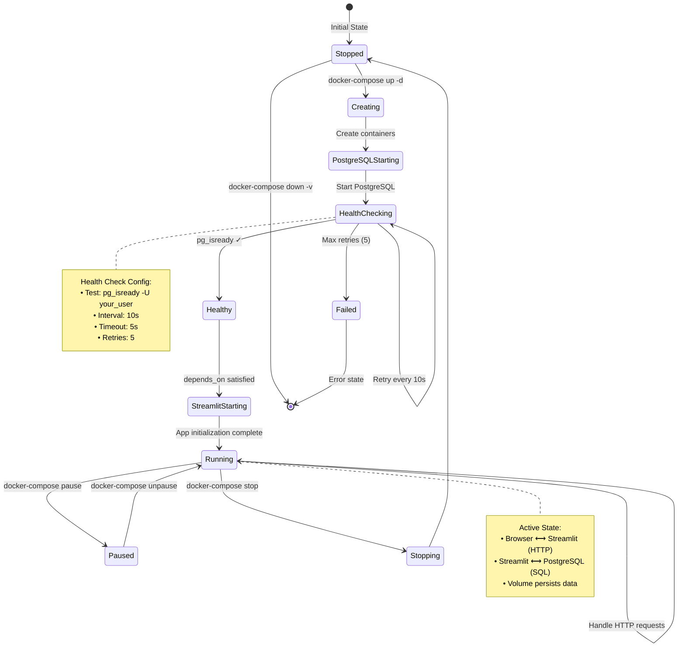

---

## 📊 Порівняльна Таблиця

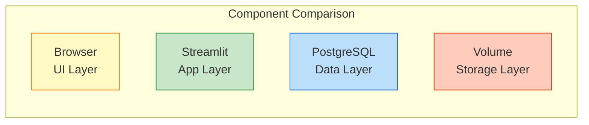

| Layer | Component | Technology | Port | Purpose |
|-------|-----------|------------|------|---------|
| 🎨 Presentation | Browser | HTML/CSS/JS | 8501 | User Interface |
| ⚙️ Application | Streamlit | Python 3.x | 8501 | Business Logic |
| 💾 Data | PostgreSQL | SQL Database | 5432 | Data Storage |
| 💿 Storage | Volume | File System | N/A | Persistence |

---

**Всі ці діаграми можна використовувати в:**
- 📄 Документації (Markdown)
- 🎓 Презентаціях (PowerPoint/Google Slides)  
- 📚 Wiki (Confluence/Notion)
- 💻 GitHub/GitLab README
- 🎨 Архітектурних документах

**Mermaid автоматично рендериться на більшості сучасних платформ!** ✨🚀📊
